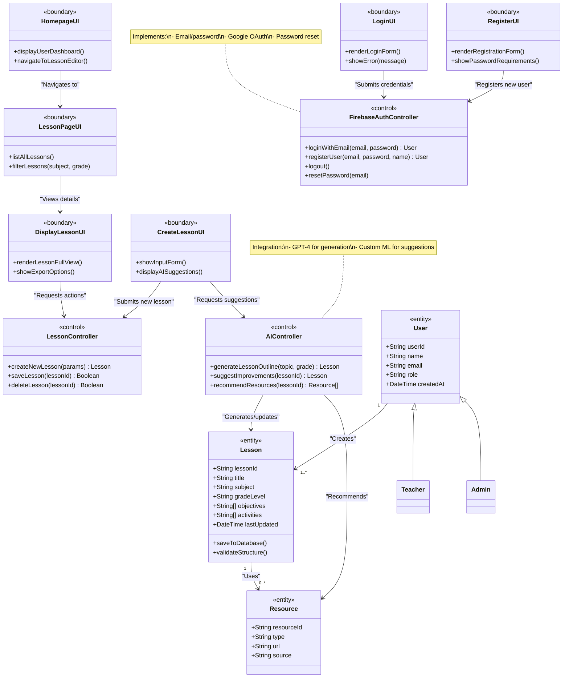

```mermaid
classDiagram
    direction TB

    %% ======================
    %% Boundary Classes (UI)
    %% ======================
    class LoginUI {
        <<boundary>>
        +renderLoginForm()
        +showError(message)
    }

    class RegisterUI {
        <<boundary>>
        +renderRegistrationForm()
        +showPasswordRequirements()
    }

    class HomepageUI {
        <<boundary>>
        +displayUserDashboard()
        +navigateToLessonEditor()
    }

    class LessonPageUI {
        <<boundary>>
        +listAllLessons()
        +filterLessons(subject, grade)
    }

    class DisplayLessonUI {
        <<boundary>>
        +renderLessonFullView()
        +showExportOptions()
    }

    class CreateLessonUI {
        <<boundary>>
        +showInputForm()
        +displayAISuggestions()
    }

    %% ======================
    %% Control Classes
    %% ======================
    class FirebaseAuthController {
        <<control>>
        +loginWithEmail(email, password) User
        +registerUser(email, password, name) User
        +logout()
        +resetPassword(email)
    }

    class LessonController {
        <<control>>
        +createNewLesson(params) Lesson
        +saveLesson(lessonId) Boolean
        +deleteLesson(lessonId) Boolean
    }

    class AIController {
        <<control>>
        +generateLessonOutline(topic, grade) Lesson
        +suggestImprovements(lessonId) Lesson
        +recommendResources(lessonId) Resource[]
    }

    %% ======================
    %% Entity Classes
    %% ======================
    class User {
        <<entity>>
        +String userId
        +String name
        +String email
        +String role
        +DateTime createdAt
    }

    class Lesson {
        <<entity>>
        +String lessonId
        +String title
        +String subject
        +String gradeLevel
        +String[] objectives
        +String[] activities
        +DateTime lastUpdated
        +saveToDatabase()
        +validateStructure()
    }

    class Resource {
        <<entity>>
        +String resourceId
        +String type
        +String url
        +String source
    }

    %% ======================
    %% Relationships
    %% ======================
    %% Authentication Flow
    LoginUI --> FirebaseAuthController : "Submits credentials"
    RegisterUI --> FirebaseAuthController : "Registers new user"

    %% Lesson Management Flow
    HomepageUI --> LessonPageUI : "Navigates to"
    LessonPageUI --> DisplayLessonUI : "Views details"
    CreateLessonUI --> LessonController : "Submits new lesson"
    DisplayLessonUI --> LessonController : "Requests actions"

    %% AI Integration
    CreateLessonUI --> AIController : "Requests suggestions"
    AIController --> Lesson : "Generates/updates"
    AIController --> Resource : "Recommends"

    %% Data Relationships
    User "1" --> "1..*" Lesson : "Creates"
    Lesson "1" --> "0..*" Resource : "Uses"

    %% Inheritance
    User <|-- Teacher
    User <|-- Admin

    %% Notes
    note for FirebaseAuthController "Implements:\n- Email/password\n- Google OAuth\n- Password reset"
    note for AIController "Integration:\n- GPT-4 for generation\n- Custom ML for suggestions"
```