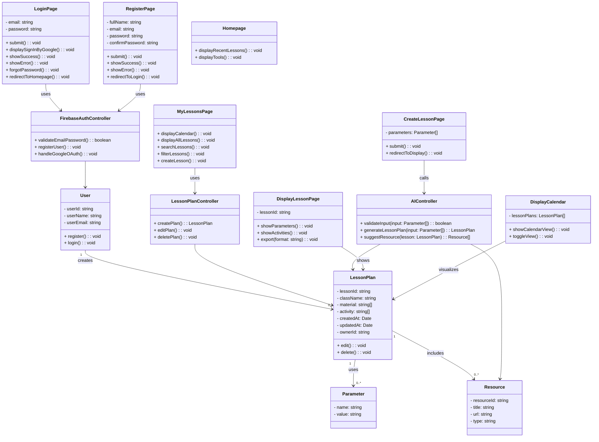

```mermaid

classDiagram
    %% ====================
    %% Entity Classes
    %% ====================
    class User {
        - userId: string
        - userName: string
        - userEmail: string
        + register(): void
        + login(): void
    }

    class LessonPlan {
        - lessonId: string
        - className: string
        - material: string[]
        - activity: string[]
        - createdAt: Date
        - updatedAt: Date
        - ownerId: string
        + edit(): void
        + delete(): void
    }

    class Parameter {
        - name: string
        - value: string
    }

    class Resource {
        - resourceId: string
        - title: string
        - url: string
        - type: string
    }

    %% ====================
    %% Controller Classes
    %% ====================
    class FirebaseAuthController {
        + validateEmailPassword(): boolean
        + registerUser(): void
        + handleGoogleOAuth(): void
    }

    class LessonPlanController {
        + createPlan(): LessonPlan
        + editPlan(): void
        + deletePlan(): void
    }

    class AIController {
        + validateInput(input: Parameter[]): boolean
        + generateLessonPlan(input: Parameter[]): LessonPlan
        + suggestResource(lesson: LessonPlan): Resource[]
    }

    %% ====================
    %% Boundary / View Classes
    %% ====================
    class LoginPage {
        - email: string
        - password: string
        + submit(): void
        + displaySignInByGoogle(): void
        + showSuccess(): void
        + showError(): void
        + forgotPassword(): void
        + redirectToHomepage(): void
    }

    class RegisterPage {
        - fullName: string
        - email: string
        - password: string
        - confirmPassword: string
        + submit(): void
        + showSuccess(): void
        + showError(): void
        + redirectToLogin(): void
    }

    class Homepage {
        + displayRecentLessons(): void
        + displayTools(): void
    }

    class MyLessonsPage {
        + displayCalendar(): void
        + displayAllLessons(): void
        + searchLessons(): void
        + filterLessons(): void
        + createLesson(): void
    }

    class CreateLessonPage {
        - parameters: Parameter[]
        + submit(): void
        + redirectToDisplay(): void
    }

    class DisplayLessonPage {
        - lessonId: string
        + showParameters(): void
        + showActivities(): void
        + export(format: string): void
    }

    class DisplayCalendar {
        - lessonPlans: LessonPlan[]
        + showCalendarView(): void
        + toggleView(): void
    }

    %% ====================
    %% Relationships
    %% ====================
    User "1" --> "0..*" LessonPlan : creates
    LessonPlan "1" --> "0..*" Parameter : uses
    LessonPlan "1" --> "0..*" Resource : includes
    LessonPlanController --> LessonPlan
    FirebaseAuthController --> User
    AIController --> LessonPlan
    AIController --> Resource
    CreateLessonPage --> AIController : calls
    MyLessonsPage --> LessonPlanController : uses
    LoginPage --> FirebaseAuthController : uses
    RegisterPage --> FirebaseAuthController : uses
    DisplayLessonPage --> LessonPlan : shows
    DisplayCalendar --> LessonPlan : visualizes

```